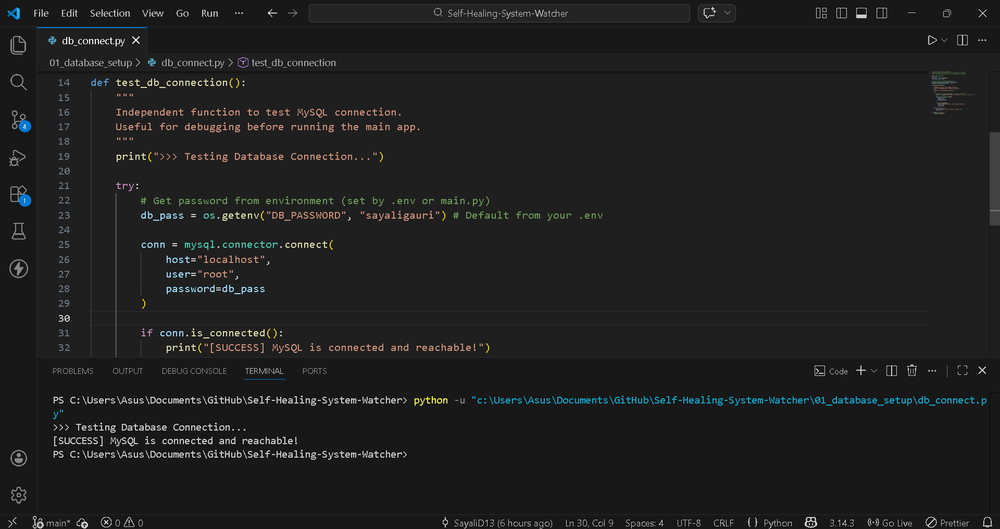
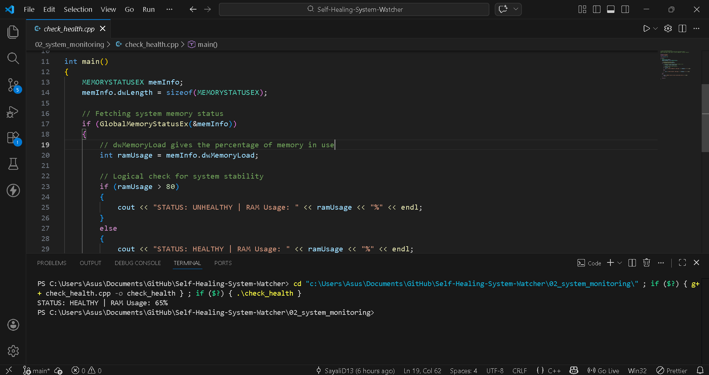
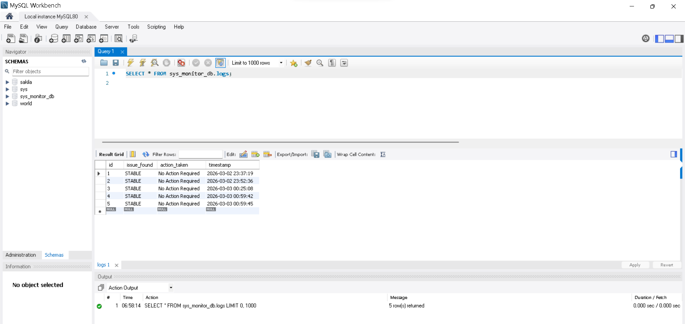
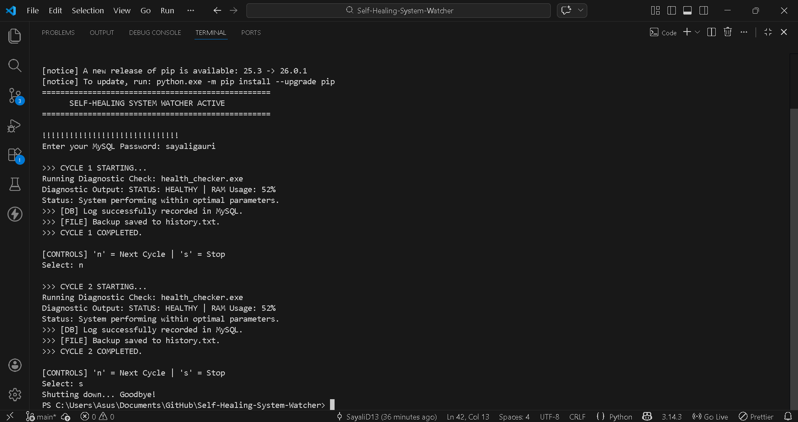

# 🛠️ Self-Healing System Watcher

**Project Introduction:** This is a hybrid automated system-monitor that combines C++ (low-level RAM sensing) and Python (decision logic) to maintain OS stability. It automatically detects high memory usage, triggers 'Self-Healing' repairs to prevent system crashes, and records all diagnostic data in a MySQL database for real-time health tracking.

### Project Live Video


### Why Hybrid? (Approach)
This project follows a two-layer design to balance performance and flexibility.
* **C++ (Sensor):** Iteracts directly with the **Windows Win32 API** to fetch real-time RAM usage data with high speed and accuracy.
* **Python (control):** Reads the data from C++, checks system conditions, performs recovery actions if needed, and stores the results in the MySQL database.


### Files & Responsibilities
* **`01_database_setup/`** – Independent tools to verify MySQL connectivity.
* **`02_system_monitoring/`** – Contains the C++ source code, compiled `.exe`, and recovery logic.
* **`03_projects_tools/`** – Manages MySQL logging and file handling operations.
* **`04_activity_logs/`** – store `history.txt` backups logs.
* **`main.py`** – Main file that runs the complete system and includes the auto-install setup process.


### Logic
1. **Monitoring:** Python runs the C++ file to get real-time RAM usage.
2. **Checking:** It checks whether the system status is STABLE or CRITICAL (above 80% RAM usage).
3. **Recovery:** If RAM usage is high, recovery actions are performed.
4. **Logging:** All results are saved in the MySQL database and also in a local text file for backup.


### Dry Run

| Step | Phase | Action | Result |
| :--- | :--- | :--- | :--- |
| 1 | **Start** | Run `main.py` | Required libraries are installed (if missing). |
| 2 | **Setup** | Check Database | Creates `sys_monitor_db` and `logs` table if not present. |
| 3 | **Monitor** | Run C++ Program | Gets real-time RAM usage data. |
| 4 | **Check** | Compare Threshold | If RAM > 80%, recovery action is triggered. |
| 5 | **Save** | Store Data | Saves results in MySQL and local history file. |


### Complexity

| Type | Details |
| :--- | :--- |
| **Time Complexity** | $O(1)$ – Monitoring and logging run in constant time. |
| **Space Complexity** | $O(1)$ – Uses minimal memory. |

**Reliability:** Built-in **Redundancy**; local text logs act as a backup if the database is offline.


###  OUTPUT

Below are some screenshots showing the project in action:

1. **Database Connection:** 

2. **System Health Check:** 
                 

3. **Main Script Running:** 


###  Run Instructions
1. Clone the project folder.
2. Execute terminal:
    ```bash
    python main.py
    ```

> **Note:** MySQL must be running. On the first run, the script will automatically install the required libraries and create the database and tables. Enter your MySQL password when prompted.


**Tech Stack:** Python 3.x, C++17, MySQL 8.0, Windows API  
